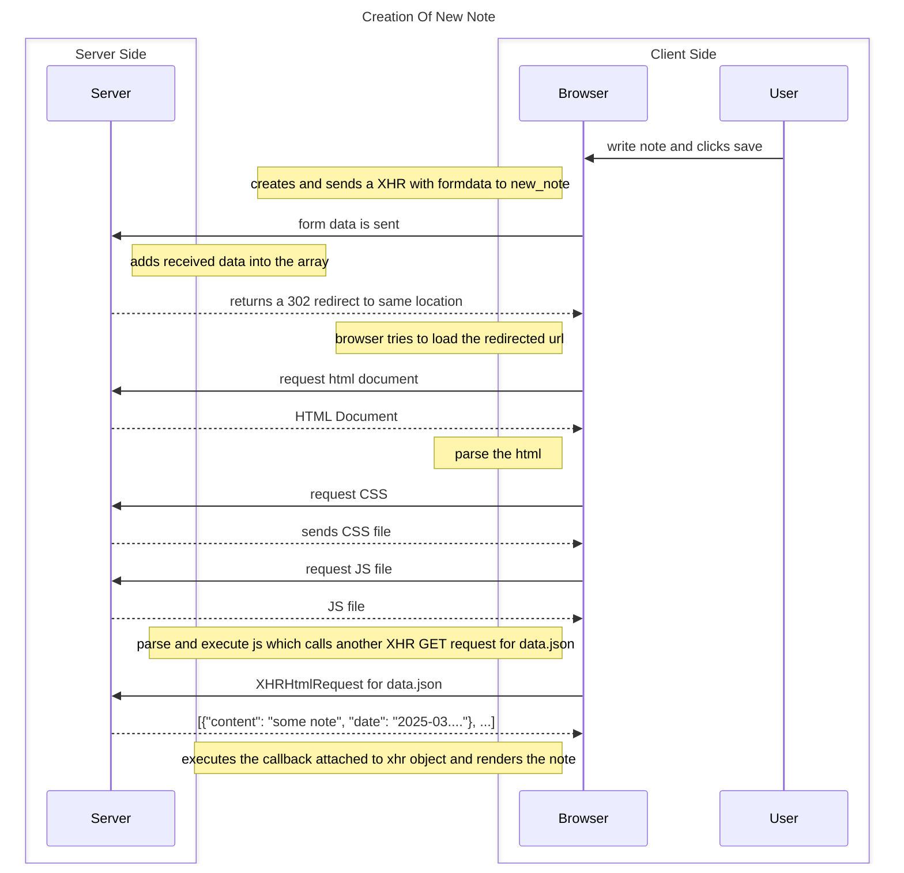

# New Note Sequence Diagram

```mermaid
    sequenceDiagram
    title Creation Of New Note

    box Server Side
    participant s as Server
    end

    box Client Side
    participant b as Browser
    participant u as User
    end

    u ->> b: write note and clicks save
    Note left of b: creates and sends a XHR with formdata to new_note
    b ->> s: form data is sent
    Note right of s: adds received data into the array
    s -->> b: returns a 302 redirect to same location
    Note left of b: browser tries to load the redirected url
    b ->> s: request html document
    s -->> b: HTML Document
    Note left of b: parse the html
    b ->> s: request CSS
    s -->> b:  sends CSS file
    b ->> s: request JS file
    s -->> b: JS file
    Note left of b: parse and execute js which calls another XHR GET request for data.json
    b ->> s: XHRHtmlRequest for data.json
    s -->> b: [{"content": "some note", "date": "2025-03...."}, ...]
    Note left of b: executes the callback attached to xhr object and renders the note
```
