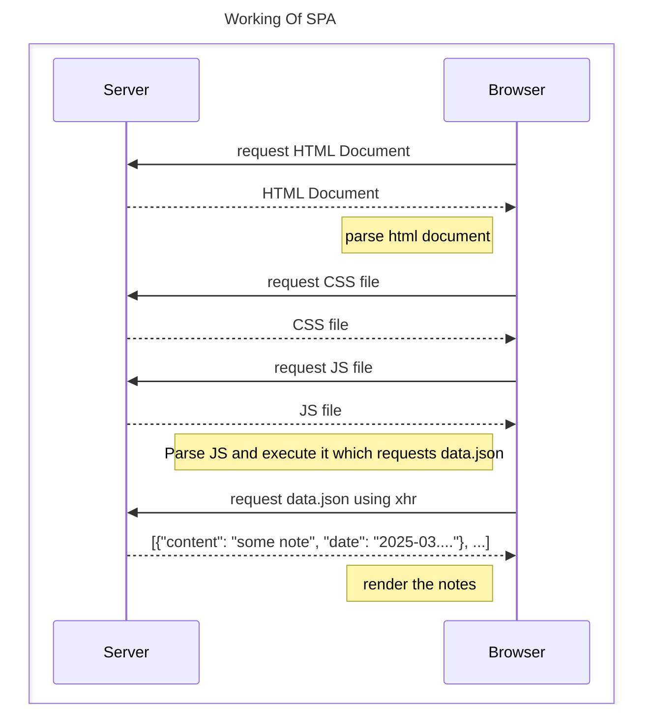

# Single Page Application Working

```mermaid
sequenceDiagram
    title Working Of SPA

    box
    participant s as Server
    participant b as Browser
    end

    b ->> s: request HTML Document
    s -->> b: HTML Document

    Note left of b: parse html document

    b ->> s: request CSS file
    s -->> b: CSS file

    b ->> s: request JS file
    s -->> b: JS file

    Note left of b: Parse JS and execute it which requests data.json

    b ->> s: request data.json using xhr
    s -->> b: [{"content": "some note", "date": "2025-03...."}, ...]

    Note left of b: render the notes


```
