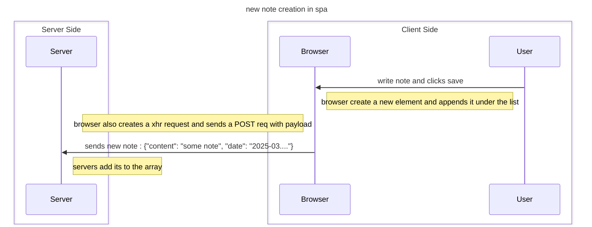

# New Note Creation in SPA

```mermaid
sequenceDiagram

    title new note creation in spa

    box Server Side
    participant s as Server
    end

    box Client Side
    participant b as Browser
    participant u as User
    end

    u ->> b: write note and clicks save
    Note right of b: browser create a new element and appends it under the list
    Note left of b: browser also creates a xhr request and sends a POST req with payload
    b ->> s: sends new note : {"content": "some note", "date": "2025-03...."}
    Note right of s: servers add its to the array

```
